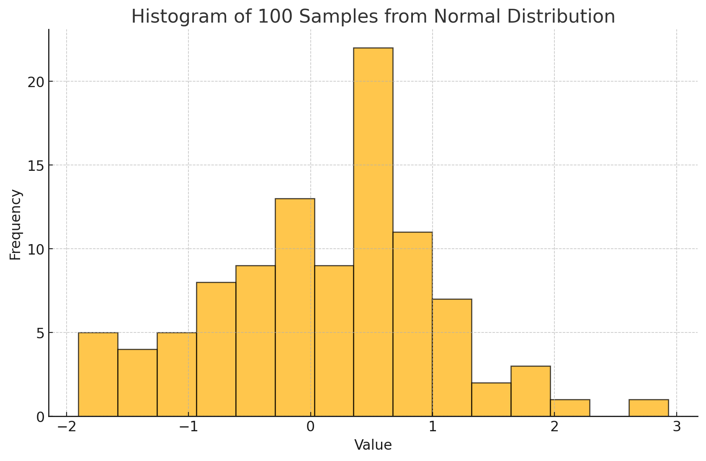
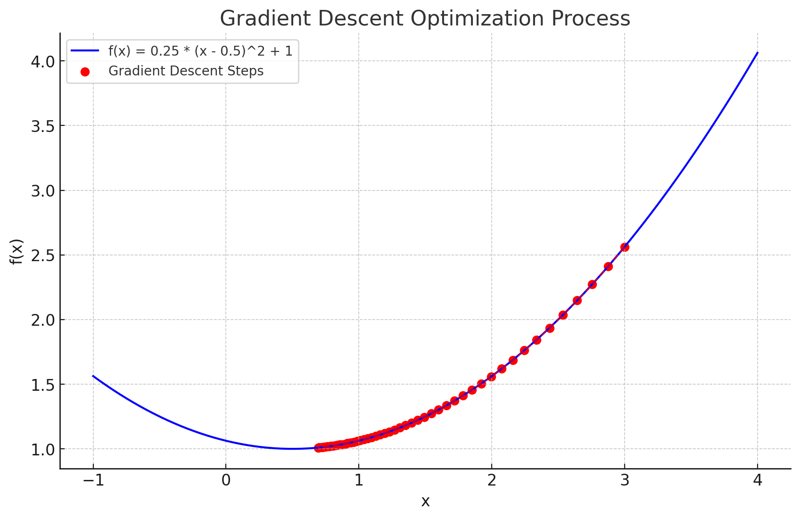

# 李嘉烨-10234804408-数据科学导论第六次作业

##  复习题

###  2. PageRank的设计思想是什么

PageRank的设计思想来源于互联网的超链接结构，用于衡量网页的重要性和排名。它由谷歌创始人拉里·佩奇（Larry Page）和谢尔盖·布林（Sergey Brin）在1996年提出。其核心思想是每个网页的超链接可以被视为对其他网页的“投票”，被更多高质量网页引用的网页通常被认为更加重要。PageRank通过这种超链接结构建立了一种循环影响机制：重要的网页不仅被更多网页链接，同时它们指向的页面也会因此获得更高的权重。这种重要性会不断传递和扩散，一个网页的PageRank值不仅取决于它的直接引用数量，还取决于引用它的网页本身的权重。为了避免一些网页不断累积权重而导致权重无限增长，PageRank引入了“阻尼系数”（通常为0.85），表示用户有85%的概率通过当前页面继续点击链接，而有15%的概率随机跳转到其他页面。这使得算法能够平衡无穷跳转路径，并确保每个网页都有一定的基础权重。这种模型反映了互联网中的真实浏览行为，同时使得PageRank能较好地评估网页的重要性，从而在搜索引擎结果中提供更为合理的排名。

###  3. 贝叶斯定理的内容是什么？有哪些应用？

贝叶斯定理是一种在已知条件下计算条件概率的数学公式，核心思想是通过先验概率和观测到的新证据来更新对事件的概率估计。贝叶斯定理的公式为：P(A|B) = [P(B|A) * P(A)] / P(B)，其中P(A|B)表示在事件B发生的情况下事件A发生的概率，P(B|A)表示在事件A发生的情况下事件B发生的概率，P(A)是事件A的先验概率，P(B)是事件B的先验概率。贝叶斯定理的本质是通过新的信息来调整对事件发生的可能性的预测。

贝叶斯定理在众多领域都有广泛应用。在医学诊断中，它用于根据检测结果更新患者患有某种疾病的概率，例如通过结合检测的灵敏度和特异性来得出更可靠的诊断。在机器学习领域，朴素贝叶斯分类器基于贝叶斯定理，用于分类任务，如垃圾邮件过滤和文本情感分析。金融领域中，贝叶斯方法常用于风险评估和投资决策，帮助更新对市场走势的判断。在法律领域，贝叶斯定理可以用于解释证据与案件的关系，通过新的证据更新对案件中嫌疑人的可能性。在天气预报中，它通过历史数据和当前观测数据来提高对天气变化的预测能力。此外，贝叶斯定理也广泛用于自然语言处理、图像识别以及机器人导航等领域，帮助系统根据不确定信息做出更好的决策。

###  4. 试阐述蒙特卡罗方法的基本原理

蒙特卡罗方法是一种基于随机抽样的数值计算方法，用于解决复杂的数学问题和模型模拟，特别适用于解析解难以求得的情况。其基本原理是通过大量随机样本的生成和统计分析来逼近问题的解。核心思想是用随机变量的性质替代精确的数学推导，通过统计平均值和概率来得到近似结果。

具体而言，蒙特卡罗方法通常包括以下步骤：首先，根据问题的数学模型构造出一个概率空间，并确定随机变量的分布。然后，利用计算机生成大量服从该分布的随机样本，接着对这些样本进行计算以得到问题所需的输出值。最后，通过对这些输出值的平均或其他统计处理，得到所求解的近似值。由于样本数量越多，随机误差会随着样本数量的增加而减小，因此结果的精度也会不断提高。

蒙特卡罗方法的应用非常广泛。在金融领域，它用于期权定价和风险评估，通过模拟大量未来市场情景来评估投资风险。在物理学和工程中，该方法用于模拟复杂系统的行为，如粒子运动轨迹或热传导过程。在计算数学中，它被用来数值积分，特别适用于高维空间的积分问题。此外，蒙特卡罗方法还广泛应用于生物学、计算机科学、人工智能等领域，比如在遗传算法中优化参数、在机器人路径规划中处理不确定性、以及在图像处理和机器学习中进行采样和训练。该方法的优势在于其适用性广泛且简单易行，即使面对复杂的高维问题或非线性模型，蒙特卡罗方法也能给出合理的近似解。

###  5. 梯度下降法的主要思想是什么？可以用通俗的方法讲出来吗？

梯度下降法的主要思想是：**找到一个让函数值最小的点，就像顺着山坡一路往下走，直到走到谷底为止**。它是一种常用的优化算法，用于在机器学习和深度学习中训练模型，找到使损失函数（误差）最小的参数。

你可以把梯度下降法想象成你站在一座大山的某个位置，而你想尽快找到山谷（即函数的最低点）。但是你不知道山谷的确切位置，只能根据你脚下的坡度来决定怎么走。坡度告诉你哪个方向更陡、朝哪个方向往下走最快。梯度下降的思路就是：**沿着坡度最陡的方向往下走**，每走一步就重新看一下自己脚下的坡度，继续调整方向。

在数学上，坡度的大小和方向由**梯度**来描述，梯度就是函数某个点处变化最快的方向。在梯度下降法中，你每次都朝着梯度的反方向走一点点，因为梯度指向上升最快的方向，而我们要最小化函数，所以要往下走。每一步的步伐大小叫做**学习率**（step size），如果步子太大，可能会错过山谷；如果步子太小，走得太慢，效率低下。

总结来说，梯度下降法就是：**反复调整参数，每次朝着能最快降低误差的方向走一小步，直到找到误差最小的位置（即函数的最低点）**。这种方法广泛应用于训练神经网络和各种机器学习模型，让它们能够学会更好地预测或分类。

##  践习题

###  1. 使用numpy生成服从正态分布的100个样本

```
[ 0.68274247, -0.4867911 , -0.60784313, -0.27844376,  0.48584755,
 -0.03499353,  0.01244136,  1.04929189,  0.05263562,  0.44023853,
  0.48847135, -0.98341464, -1.90350103,  0.02153663, -0.21048707,
 -0.22285875,  1.41697934,  0.13298374,  0.40392233, -1.31695576,
 -0.30108629,  0.79313907,  0.3035099 ,  1.22618941, -1.66929511,
  2.93252381,  0.3752996 ,  1.81343368, -0.057261  ,  0.21248121,
  2.17526418, -1.52893826,  0.91111376,  1.16356541,  1.50271737,
  0.78579023,  0.59171663, -0.74866411,  0.37114002, -0.03820285,
  0.14814441, -0.35648986, -0.59263356, -0.98632214,  0.93737856,
  0.15109765,  0.5342132 ,  0.9728457 ,  1.03377323, -0.03417807,
  0.07936248, -0.49311346,  0.4547765 , -1.70851752, -0.89205081,
  1.06571205, -0.67999917, -1.04712368,  0.77084597, -1.00258102,
 -0.66328543, -1.2836932 ,  0.26957872,  0.62150317, -0.98470072,
 -1.49466968,  1.0510884 ,  0.4670551 , -0.67320128, -0.74650156,
 -0.43743654,  0.61512948,  0.39767655, -1.80206788, -0.25135373,
  1.91833748,  0.59406082, -0.61135855,  0.54656733,  0.77989832,
 -0.1905561 ,  0.92940267,  0.50800365,  1.78413335,  0.81237324,
 -0.14717429,  0.54075084, -1.69803365,  0.56668689, -0.84026133,
 -0.91029398,  0.52937218,  0.73507193, -0.02750494,  0.48931325,
  1.06963021,  0.52903113, -0.35373913,  0.42280704,  0.33896396]
```


###  2. 通过Python程序为抽样出的样本绘图展示

```python
import numpy as np
import matplotlib.pyplot as plt

# 生成服从标准正态分布（均值为0，标准差为1）的100个样本
samples = np.random.normal(loc=0, scale=1, size=100)

# 绘制生成的正态分布样本的直方图
plt.figure(figsize=(10, 6))
plt.hist(samples, bins=15, edgecolor='black', alpha=0.7)
plt.title('Histogram of 100 Samples from Normal Distribution')
plt.xlabel('Value')
plt.ylabel('Frequency')

# 显示图表
plt.show()
```




###  3. 通过Python程序计算矩阵((2, 1), (4, 5))的特征值和特征向量

```python
import numpy as np

# 定义矩阵
matrix = np.array([[2, 1], [4, 5]])

# 计算特征值和特征向量
eigenvalues, eigenvectors = np.linalg.eig(matrix)

# 输出特征值和特征向量
print("特征值:")
print(eigenvalues)
print("\n特征向量:")
print(eigenvectors)
```

答案如下：
```
特征值： 1 6
特征向量：
[[-0.70710678 -0.24253563]
 [ 0.70710678 -0.9701425 ]]
```


###  5. 给出数据矩阵如下，通过Python程序计算协方差矩阵C

```python
import numpy as np

# 定义数据矩阵，每一行对应一个变量 X, Y, Z
data = np.array([[1, -1, 4], 
                 [2, 1, 3], 
                 [1, 3, -1]])

# 使用 np.cov 计算协方差矩阵，rowvar=True 表示每一行是一个变量
cov_matrix = np.cov(data, rowvar=True)

# 输出协方差矩阵
print("协方差矩阵 C:")
print(cov_matrix)
```

```
C = 
(6.33 2.5 -5)
(2.5   1  -2)
(-5   -2   4)
```

###  #. 求解f(x) = 0.25*(x-0.5)^2 + 1的局部极小值，绘图展示梯度下降发的迭代过程

f(x)的局部极小值为 x=0.5


