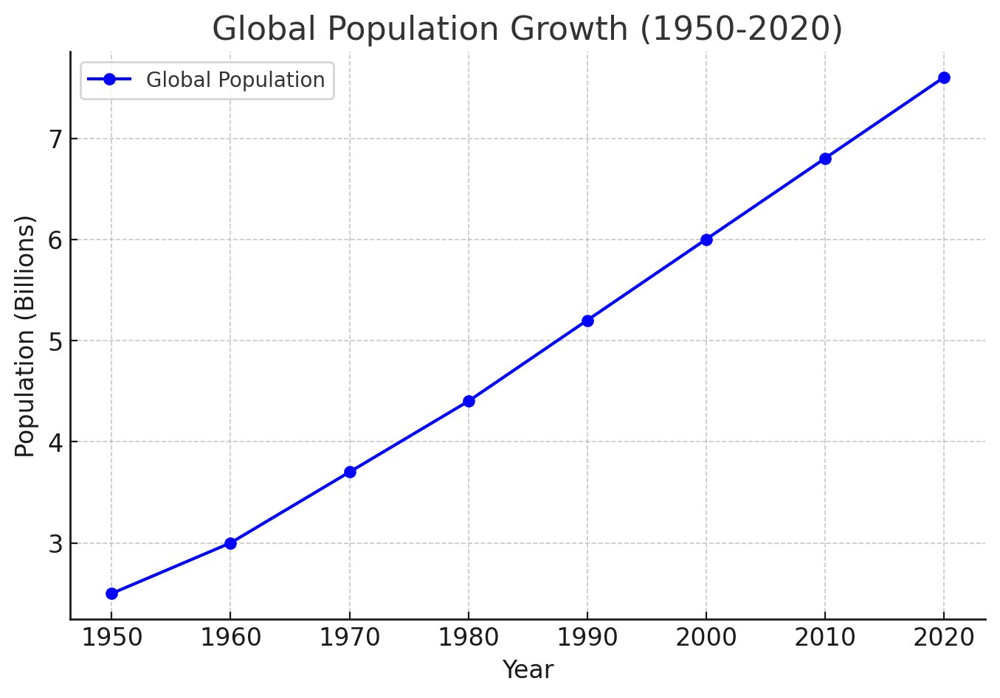
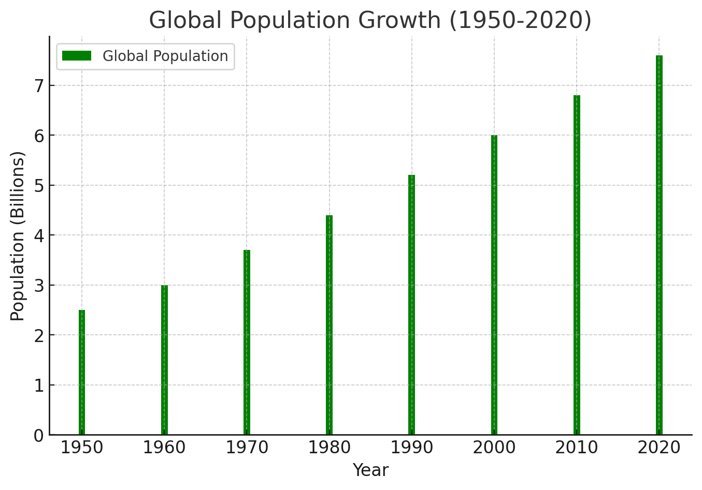
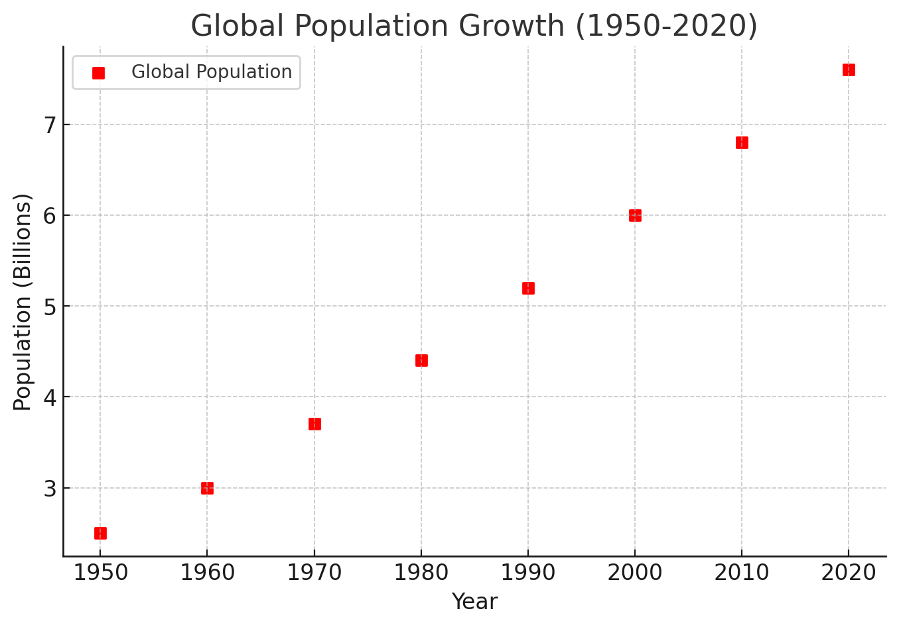
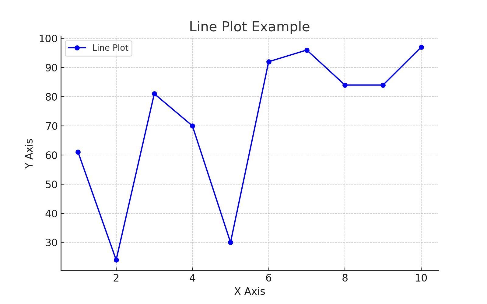
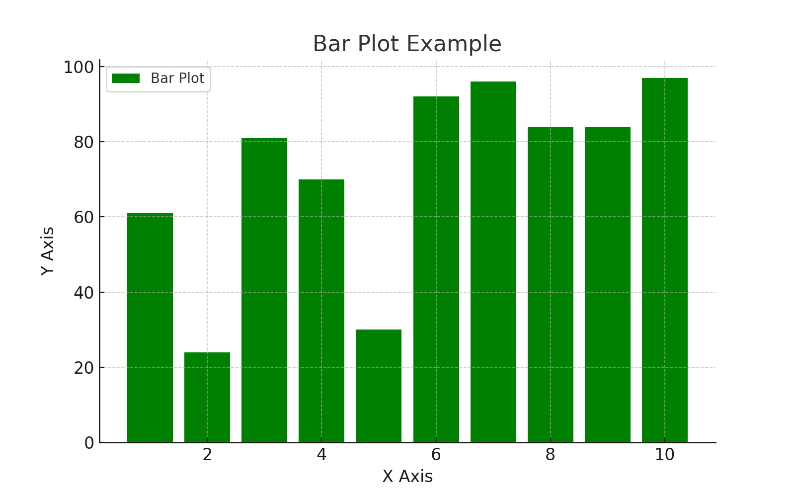
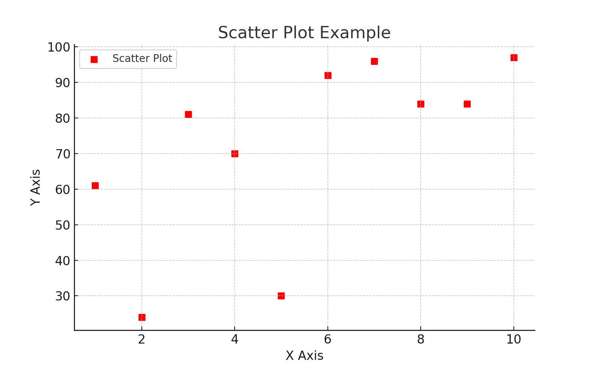

#  数据科学与工程导论作业04

##  课后题1-6

###  课后题1 

##### 数据的全生命周期管理包括哪些阶段？

1. **数据创建与收集**：

•	数据生成、收集的起始阶段，确保数据的准确性和合规性。

2. **数据存储**：

•	数据分类存储，优化存储成本，并保证数据的安全和可访问性。

3. **数据使用**：

•	数据被访问、分析和使用，确保数据质量和安全性。

4. **数据共享与分发**：

•	数据在内部或外部进行共享时需确保隐私保护和安全。

5. **数据归档与保留**：

•	将不再活跃但需要保留的数据归档，以符合合规和审计需求。

6.	**数据销毁**：

•	当数据不再需要时，按照规定进行安全删除或销毁，防止数据泄露。

###  课后题2

##### 数据采集的概念是什么？ 都有哪些方法？

**数据采集的概念**：

数据采集是指通过一定的技术手段从各种来源获取原始数据的过程。它是数据生命周期管理的第一个阶段，旨在从物理设备、传感器、数据库、用户输入、网络、日志等来源收集相关信息，为后续的数据存储、处理、分析等操作提供基础。

**数据采集的方法**：

​	1.	**手动采集**：

​	•	通过人工输入或操作收集数据，常见于调查问卷、表格填写等。

​	2.	**自动化采集**：

​	•	通过自动化工具从系统、应用程序、设备、传感器中持续收集数据。

​	3.	**传感器采集**：

​	•	物联网设备或传感器自动采集物理环境中的数据，如温度、湿度、位置等。

​	4.	**网络爬虫采集**：

​	•	使用爬虫程序从网站或网络资源中自动抓取数据。

​	5.	**日志数据采集**：

​	•	从服务器、应用程序或系统日志中获取操作、访问、错误等信息。

​	6.	**API 采集**：

​	•	通过应用编程接口（API）从第三方服务、应用中获取数据。

​	7.	**批量文件采集**：

​	•	从文件（如 CSV、Excel、JSON 等格式）中批量读取和导入数据。

​	8.	**数据库采集**：

​	•	通过数据库查询从结构化数据库中获取特定的数据。


###  课后题3

##### **什么是数据管理？ 比较传统的数据管理和大数据管理技术有什么异同？**

数据管理是对数据从生成、存储、处理、保护、共享、分析到销毁的全过程进行规划、控制和监督的一系列活动和技术手段，旨在确保数据的质量、安全性、可用性和完整性，支持企业或组织的业务和决策。

传统数据管理和大数据管理技术的异同主要体现在以下几个方面。相同点在于它们的目标一致，都是确保数据的质量、安全性和可用性，支持业务运营和决策，并且都需要良好的数据治理机制，如权限管理、隐私保护和合规性。不同点主要体现在数据规模、数据类型、存储技术和处理方式上。传统数据管理主要处理较小规模的数据，通常为GB到TB级别，数据类型以结构化数据为主，使用关系型数据库存储，处理方式多为单台服务器或小规模集群。大数据管理则处理海量数据，通常为PB级别，数据类型复杂，包含结构化、半结构化和非结构化数据，使用分布式存储系统，如HDFS或NoSQL，处理方式也依赖于分布式计算框架，如MapReduce或Spark。

###  课后题4

###### 大数据的计算模式可以分为哪几类？

1.	**批处理模式**：批处理是一种针对大量数据进行一次性处理的计算模式。典型的批处理框架有 Hadoop 的 MapReduce 和 Apache Spark。它适用于需要处理大规模静态数据集的任务，通常用于离线分析。

2.	**流处理模式**：流处理是一种实时处理数据流的计算模式，适用于处理连续不断的数据流。常见的流处理框架有 Apache Flink、Apache Storm 和 Spark Streaming。它能对数据进行低延迟处理，适用于实时数据分析、监控和处理。

3.	**交互式处理模式**：交互式处理允许用户通过查询或命令与数据进行实时交互，获得快速的响应结果。Apache Hive、Presto 和 Impala 都支持交互式处理，通常用于大数据查询和分析任务。

4.	**内存计算模式**：内存计算是一种通过将数据加载到内存中进行高速计算的模式，具有极高的处理性能。Apache Spark 是一个典型的内存计算框架，适用于需要快速处理大数据的场景。

5. **图计算模式**：图计算是针对图结构数据进行处理的模式，用于分析和处理复杂的关系数据，如社交网络、物流网络等。典型的图计算框架有 Apache Giraph 和 Neo4j。

6.	**机器学习和深度学习模式**：大数据中的机器学习和深度学习处理模式，通常依赖于分布式计算框架进行训练和预测。常见的框架有 Apache Mahout、TensorFlow、PyTorch 等，用于大规模数据的模型训练和预测。

###  课后题5

##### **什么是数据分析？有哪些数据分析的方法或者模型？**

数据分析是通过对数据的收集、整理、处理和解释，提取有价值的信息和洞见，帮助做出数据驱动的决策的过程。数据分析的目的是通过揭示数据的趋势、模式、相关性等信息，支持业务决策、优化运营和预测未来趋势。

数据分析的方法和模型主要包括以下几种：

1.	**描述性分析**：描述性分析是对已有数据进行总结和描述，帮助理解数据的总体特征。常用的方法包括平均值、标准差、频率分析等。它回答的是“发生了什么”的问题。

2.	**诊断性分析**：诊断性分析是进一步探讨描述性分析结果的原因，找出背后的关联性和原因。常用方法包括回归分析、假设检验等，目的是理解“为什么发生”。

3.	**预测性分析**：预测性分析基于历史数据和统计模型，来预测未来的趋势或结果。常用的方法包括时间序列分析、回归分析、机器学习模型等，帮助回答“会发生什么”的问题。

4.	**规范性分析**：规范性分析通过模拟、优化等技术，帮助制定行动计划和决策。常用的方法有线性规划、模拟模型等，解决“该如何做”的问题。

5.	**探索性数据分析（EDA）**：探索性数据分析用于发现数据中的隐藏模式和关系，通常在没有明确假设的情况下进行。常用的方法包括可视化、聚类、关联规则挖掘等。

6.	**因果分析**：因果分析是用来探索因果关系的分析方法，通过实验设计和因果推断方法来确定数据中变量之间的因果关系。

7.	**统计建模**：统计建模是通过建立数学模型来解释数据的分布和关系，常见的模型包括线性回归、逻辑回归、贝叶斯模型等。

8.	**机器学习**：机器学习是利用算法从数据中自动学习并做出预测或分类，常用的模型有决策树、随机森林、支持向量机、神经网络等，用于解决复杂预测和模式识别问题。

###  课后题6

**数据可视化的原因有哪些？**

1.	**更容易理解和解释数据**：通过图形、图表等方式展示数据，可以将复杂的数字和统计信息转化为直观的图像，帮助快速理解数据中的趋势、模式和关系。

2.	**发现隐藏的模式和关系**：数据可视化能够让我们更容易识别数据中的异常、相关性和趋势等，帮助发现隐藏在大数据中的重要信息。

3.	**简化复杂信息的展示**：面对大量复杂的数据，通过可视化技术能够简化数据的展示，使非技术人员也能轻松理解数据背后的意义。

4.	**增强决策的支持**：数据可视化能够帮助管理者和决策者通过直观的图形和图表做出更加准确、快速的决策。

5.	**便于沟通和共享**：可视化图表有助于在团队或跨部门之间传达数据分析的结果，使数据更具说服力，便于交流和汇报。

6.	**提升数据的吸引力和参与度**：通过使用数据可视化，可以提高数据展示的吸引力，使观众更愿意关注和理解数据分析的结果。


##  践习题7.8

###  践习题7

熟悉可视化包 Matplotib，绘制任一数据集的三种常见图形。

散点图：
```python
plt.figure(figsize=(8, 5))  # 设置图形大小
plt.plot(x, y, marker='o', color='b', label='Line Plot')  # 绘制折线图
plt.title('Line Plot Example')  # 设置标题
plt.xlabel('X Axis')  # 设置X轴标签
plt.ylabel('Y Axis')  # 设置Y轴标签
plt.legend()  # 显示图例
plt.grid(True)  # 显示网格
plt.show()  # 显示图形
```



柱状图：
```python
plt.figure(figsize=(8, 5))
plt.bar(x, y, color='g', label='Bar Plot')  # 绘制柱状图
plt.title('Bar Plot Example')
plt.xlabel('X Axis')
plt.ylabel('Y Axis')
plt.legend()
plt.show()
```



散点图：
```python
plt.figure(figsize=(8, 5))
plt.scatter(x, y, color='r', marker='s', label='Scatter Plot')  # 绘制散点图
plt.title('Scatter Plot Example')
plt.xlabel('X Axis')
plt.ylabel('Y Axis')
plt.legend()
plt.show()
```



###  践习题8

熟悉可视化包Seaborne，绘制任一数据集的三种常见图形

```python
import numpy as np
import seaborn as sns
import matplotlib.pyplot as plt

# 生成随机数据
np.random.seed(42)  # 设置随机种子以确保可重复性
x = np.arange(1, 11)  # X轴数据，1到10
y = np.random.randint(10, 100, size=10)  # 随机生成Y轴数据

# 1. 折线图（Line Plot）
plt.figure(figsize=(8, 5))
plt.plot(x, y, marker='o', color='b', label='Line Plot')
plt.title('Line Plot Example')
plt.xlabel('X Axis')
plt.ylabel('Y Axis')
plt.legend()
plt.grid(True)
plt.show()

# 2. 柱状图（Bar Plot）
plt.figure(figsize=(8, 5))
plt.bar(x, y, color='g', label='Bar Plot')
plt.title('Bar Plot Example')
plt.xlabel('X Axis')
plt.ylabel('Y Axis')
plt.legend()
plt.show()

# 3. 散点图（Scatter Plot）
plt.figure(figsize=(8, 5))
plt.scatter(x, y, color='r', marker='s', label='Scatter Plot')
plt.title('Scatter Plot Example')
plt.xlabel('X Axis')
plt.ylabel('Y Axis')
plt.legend()
plt.show()
```






